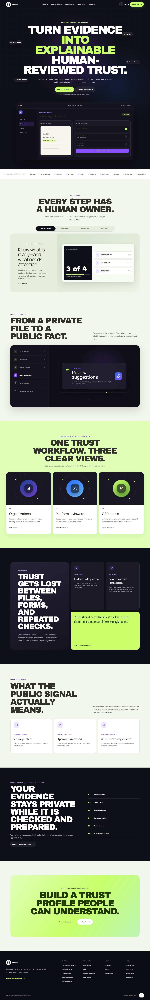
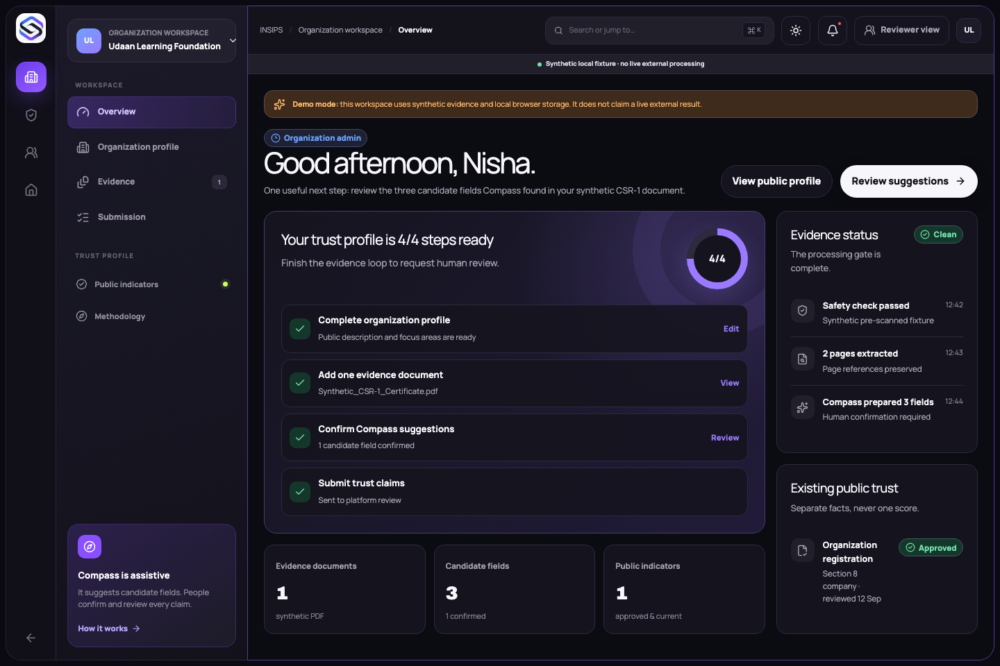
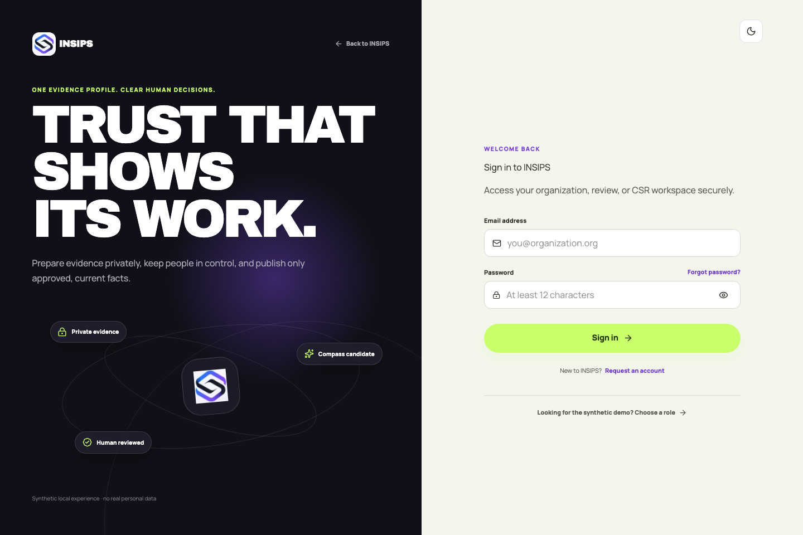
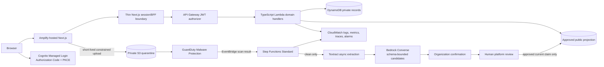

# INSIPS

INSIPS turns private evidence into specific, explainable trust signals for social-impact organizations. INSIPS Compass assists with extraction and candidate preparation; organizations confirm their own facts; independent platform reviewers decide each claim; and the public sees only current approvals with a meaning and review date.

This repository is a new hackathon implementation for WeMakeDevs x AWS First Commit. All people, organizations, documents, addresses, identifiers, review decisions, and activity shown in the demo are synthetic.

## What works locally

- Responsive public landing page, discovery, organization profile, and trust explainer.
- Organization readiness dashboard, profile editor, evidence list, staged processing timeline, Compass candidate confirmation, and review submission.
- Platform review queue, claim-by-claim source comparison, approve/reject/request-changes decisions, and approved-only public presentation.
- CSR discovery and a browser-local shortlist.
- Light and dark themes, keyboard-visible focus, reduced-motion support, mobile workspace navigation, intentional empty states, and safe fixture labelling.
- Strict schemas, document and claim state transitions, deny-by-default role/tenant policy, and tests for the highest-risk publication rules.
- AWS CDK for Cognito, HTTP API/Lambda, DynamoDB, private S3, conditional GuardDuty Malware Protection, EventBridge, Step Functions, Textract, Bedrock, CloudWatch, and a conditional AWS Budget.

The local experience is intentionally labelled as a synthetic fixture. It does not claim that GuardDuty, Textract, Bedrock, Cognito, or DynamoDB ran locally.

## Product preview







## Route inventory

- Public: `/`, `/discover`, `/organizations/[slug]`, `/for-organizations`, `/for-csr-teams`, `/how-trust-works`, `/trust-methodology`, `/compass`, `/resources`, `/faq`, `/security-privacy`, `/help`, `/about`, `/contact`, and `/hackathon`.
- Authentication and demo: `/auth/sign-in`, `/auth/sign-up`, `/auth/forgot-password`, `/auth/reset-password`, `/auth/verify-email`, `/auth/session-expired`, and `/demo`.
- Organization: `/app`, `/app/profile`, `/app/evidence`, `/app/evidence/[id]`, and `/app/submission`.
- Review and CSR: `/review`, `/review/submission-demo`, `/csr/discover`, and `/csr/shortlist`.
- Legal and resilient states: `/privacy`, `/terms`, `/cookies`, `/accessibility`, `/forbidden`, `/offline`, plus global loading, error, and not-found UI.

## Architecture



Security-critical boundaries:

- Browser identity is never trusted as authorization. API Gateway verifies the Cognito JWT; Lambda must load capability and tenant membership server-side.
- A GuardDuty `NO_THREATS_FOUND` event is the only scan result routed into extraction. `THREATS_FOUND`, `UNSUPPORTED`, `ACCESS_DENIED`, and `FAILED` remain blocked.
- Extracted text is untrusted. Compass has no tools, receives a bounded prompt, and its JSON must pass the shared Zod schema.
- Review decisions are separate records. Updating an approved source value invalidates the public projection until re-review.

## Repository

```text
apps/web/                  Next.js App Router product
infra/                     AWS CDK and Lambda handlers
packages/contracts/        schemas, state machines, policy, public projection
docs/                      decisions, data model, security, costs, demo, submission
output/pdf/                safe synthetic evidence fixture
scripts/                   repeatable fixture generation
```

## Local setup

Prerequisites: Node.js 22, pnpm 11.19.0, and Python with ReportLab only when regenerating the PDF.

```bash
pnpm install --frozen-lockfile
cp .env.example .env.local
pnpm dev
```

Open `http://localhost:3000`. The local flow stores only synthetic demo decisions in browser storage under `insips-demo-v1`.

### Local demo roles

No demo passwords are required before Cognito is deployed. `/demo` is a clearly labelled synthetic role launcher, separate from the polished authentication presentation. The submission screen links to the synthetic reviewer queue, reviewer pages link to the signed-out public result, and the public header exposes CSR discovery. These role switches are transparent local-fixture navigation, not simulated authentication or an authorization boundary.

## Checks

```bash
pnpm lint
pnpm typecheck
pnpm test
pnpm build
pnpm --filter @insips/web e2e
```

The contracts suite covers tenant isolation, self-approval denial, reviewer assignment, expired sessions, clean-before-extract transitions, claim review transitions, approved-only publication, stale-approval invalidation, and restricted-field removal. CDK assertions cover private storage, encryption, DynamoDB recovery, Cognito registration policy, Node.js 22 Lambdas, the Step Functions workflow, and the GuardDuty event boundary.

The DynamoDB access patterns and key design are recorded in `docs/DYNAMODB.md`; keys were derived from those access patterns rather than guessed from screens. `docs/OPERATIONS.md` is the CloudWatch-safe troubleshooting runbook.

## AWS setup and deployment gate

Do not deploy until all four manual inputs are resolved:

1. Chosen AWS region with Cognito, GuardDuty Malware Protection for S3, Textract, and a suitable Bedrock text model verified.
2. Named AWS SSO/CLI profile authenticated locally. Never paste credentials into chat or a file.
3. Approved monthly budget and notification email.
4. Approval to enable cost-bearing GuardDuty, Textract, and Bedrock resources.

After approval:

```bash
aws sso login --profile YOUR_PROFILE
pnpm --filter @insips/infra synth
pnpm --filter @insips/infra deploy -- --profile YOUR_PROFILE \
  --parameters AppOrigin=https://YOUR_AMPLIFY_DOMAIN \
  --parameters EnableMalwareProtection=true \
  --parameters BedrockModelId=VERIFIED_MODEL_OR_INFERENCE_PROFILE \
  --parameters MonthlyBudgetUsd=APPROVED_AMOUNT \
  --parameters BudgetEmail=APPROVED_EMAIL
```

The deployment intentionally defaults malware protection off and the budget amount to zero. That makes unresolved cost decisions visible instead of silently enabling a paid workflow. `docs/COSTS.md` contains the service-by-service model and shutdown procedure.

Amplify Hosting should be connected to the authorized public GitHub repository using `amplify.yml`. Current AWS documentation supports managed Next.js SSR through Next.js 15, so this project pins Next.js 15 with React 19; see `docs/DECISIONS.md`.

## Demo data and reset

The safe PDF fixture is `output/pdf/Synthetic_CSR-1_Certificate.pdf`. Regenerate it with:

```bash
python3 scripts/create_synthetic_pdf.py
```

Reset the browser demo by deleting the `insips-demo-v1` local-storage item or clearing site data. The exact three-minute path and backup plan are in `docs/DEMO.md`.

## Current limitations

- AWS is not deployed because region, profile, spending ceiling, budget email, and paid-service approval are unresolved.
- Cognito Managed Login is represented locally by a transparent role picker, not a simulated password flow.
- The Next.js BFF/domain API connection, live presigned upload endpoint, durable review writes, and Amplify deployment remain release work after cloud authorization.
- The user-supplied pre-existing INSIPS logo is included at the owner's explicit direction; broader redistribution terms remain the owner's responsibility.
- The synthetic pipeline UI demonstrates the intended states; it never labels fixture data as a live AWS result.

## Teardown

Review the target account and region twice, then require explicit owner confirmation before running:

```bash
pnpm --filter @insips/infra destroy -- --profile YOUR_PROFILE
```

The evidence bucket has deletion protection through retained objects: `autoDeleteObjects` is false. Emptying or deleting evidence is intentionally a separate destructive manual action.

## Hackathon disclosure

OpenAI Codex assisted with implementation, tests, documentation, and review. Product decisions and submission claims require human verification. Pre-existing concept and screenshot references were used only for planning and visual direction. See `CREDITS.md` for libraries, licences, and asset status.
